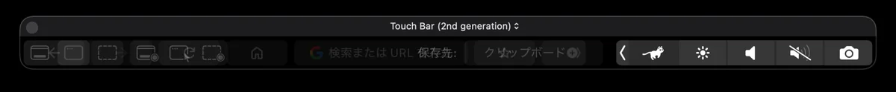

# RuncatTouchBar

RunCat, right where your fingers already are.

[](https://github.com/nisesimadao/RuncatTouchBar/releases/latest)
[](https://github.com/nisesimadao/RuncatTouchBar/actions/workflows/release.yml)
[](#requirements)

<p align="center">
  
</p>

RuncatTouchBar is an experimental macOS utility based on **RunCat Neo**. It keeps the selected RunCat runner inside the MacBook Pro **Control Strip**, while leaving Apple's normal brightness, volume, and other controls in place.

Tap the runner to expand a compact system monitor directly on the Touch Bar.

[日本語版 README](./README_jp.md)

## Highlights

- **RunCat in the Control Strip** — the runner stays beside Apple's normal Touch Bar controls
- **Shared RunCat state** — selected runner, custom runners, and CPU-driven animation speed follow RunCat Neo
- **Live system metrics** — CPU, memory, storage, network traffic, and battery
- **Shared monitoring settings** — Memory / Storage / Network / Battery visibility follows the main RunCat settings
- **Shared refresh interval** — the Touch Bar follows RunCat's 3 / 5 / 10 second update setting
- **Top CPU processes** — horizontally scroll through active user processes with app icons and CPU usage
- **Quit controls** — request normal termination or force quit a process from the Touch Bar
- **Activity Monitor shortcut** — jump to the full macOS Activity Monitor when needed
- **Native Control Strip preserved** — RuncatTouchBar adds one system-tray item instead of replacing the whole strip

## Touch Bar monitor

<p align="center">
  
</p>

The expanded monitor uses the same system-information source as the main RunCat UI where possible. Process rows are updated in place to reduce scroll jumps, and ranking changes are delayed while you are actively swiping.

Process names and CPU percentages use separate fields, so long application names can truncate without hiding CPU usage.

## Download & install

Download `RuncatTouchBar.zip` from [Releases](https://github.com/nisesimadao/RuncatTouchBar/releases/latest), unzip it, and move `RuncatTouchBar.app` to `/Applications`.

Release builds are **ad-hoc signed, but not Developer ID signed or notarized**. macOS Gatekeeper may block the first launch. If it does:

1. Right-click `RuncatTouchBar.app` and choose **Open**.
2. Choose **Open** again in the confirmation dialog.

If necessary:

```bash
xattr -dr com.apple.quarantine /Applications/RuncatTouchBar.app
```

See the [FAQ](./docs/FAQ.md) for more details.

## Settings

RuncatTouchBar intentionally reuses the existing RunCat Neo settings instead of maintaining a second configuration system.

<p align="center">
  
</p>

Runner selection, custom runners, animation speed behavior, enabled metrics, and monitoring interval stay shared between the menu-bar app and Touch Bar surface.

## Requirements

- Touch Bar-equipped MacBook Pro
- macOS 26 or later
- Apple Silicon for the current downloadable build

Building from source currently expects Xcode 26.5+ and Swift 6.2.

## Private API / security note

Apple does not expose a public API for adding custom items to the Control Strip. RuncatTouchBar therefore resolves private Touch Bar APIs at runtime, including `DFRElementSetControlStripPresenceForIdentifier` and system-tray/modal Touch Bar selectors.

The app also disables App Sandbox for the RuncatTouchBar target so it can inspect and terminate user processes. This is an intentional trade-off for the process-monitor feature. See [Security](./docs/SECURITY.md) and [Privacy](./docs/PRIVACY.md).

If the required private APIs are unavailable, the Control Strip integration does not start.

## Technical notes

- Swift / SwiftUI + AppKit
- `NSTouchBar` plus dynamically resolved private Touch Bar APIs
- Shared `AppDependencies` / RunCat state streams for runner and system metrics
- `SystemInfoKit` for CPU, memory, storage, network, and battery information
- `ps` sampling for the top user-process list
- in-place process row updates with scroll-aware ranking refresh
- separate bundle identifier: `dev.nisesimadao.RuncatTouchBar`

## Build from source

For a quick physical-Touch-Bar test build:

```bash
bash scripts/build-test-app.sh
```

Or build directly:

```bash
xcodebuild \
  -project RunCatNeo.xcodeproj \
  -scheme RunCatNeo \
  -configuration Release \
  -destination 'generic/platform=macOS' \
  ARCHS=arm64 \
  CODE_SIGNING_ALLOWED=NO \
  CODE_SIGNING_REQUIRED=NO \
  build
```

## Releases / CI

Pushing a `vX.Y.Z` tag runs the release workflow. It builds the arm64 app, validates the version, applies an ad-hoc signature, packages `RuncatTouchBar.zip`, uploads a workflow artifact, and publishes a GitHub Release with generated notes.

Normal pushes to `main` continue to use the separate **Build & Package** workflow for development artifacts.

## Project docs

- [Changelog](./docs/CHANGELOG.md)
- [FAQ](./docs/FAQ.md)
- [Privacy](./docs/PRIVACY.md)
- [Security](./docs/SECURITY.md)
- [Screenshot checklist](./docs/DEMO_ASSETS.md)
- [Release checklist](./docs/RELEASE_CHECKLIST.md)
- [Release notes template](./docs/RELEASE_NOTES_TEMPLATE.md)
- [Contributing](./CONTRIBUTING.md)
- [License](./LICENSE)

## Upstream

RuncatTouchBar is derived from **RunCat Neo** by Kyome22 / RunCat Developers.

- Upstream: https://github.com/runcat-dev/RunCatNeo
- License: Apache License 2.0

The upstream license and copyright notices are retained in this repository.

## Status

The project compiles and packages successfully in GitHub Actions. Physical Touch Bar rendering and Control Strip integration have also been verified on a Touch Bar Mac. Process actions should still be treated carefully because they terminate real user processes.
