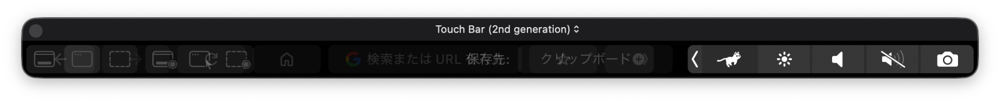
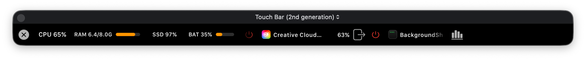
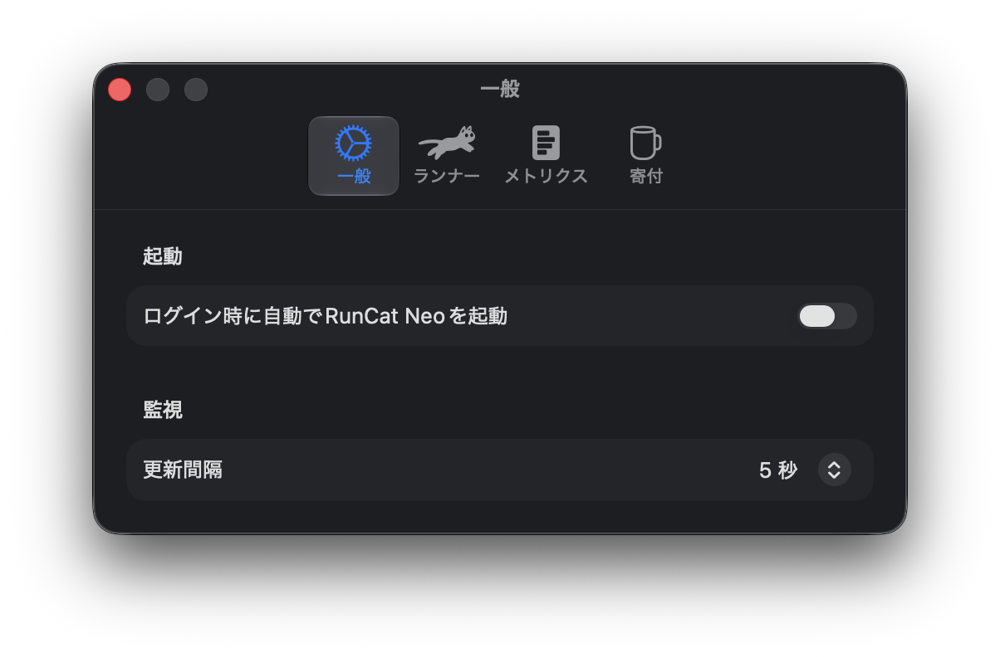

# RuncatTouchBar

指のすぐそばで走る RunCat。

[](https://github.com/nisesimadao/RuncatTouchBar/releases/latest)
[](https://github.com/nisesimadao/RuncatTouchBar/actions/workflows/release.yml)
[](#必要環境)

<p align="center">
  <a href="docs/assets/touchbar-overview.png">
    
  </a>
</p>

RuncatTouchBar は **RunCat Neo** をベースにした実験的な macOS ユーティリティです。MacBook Pro の **Control Strip** に選択中の RunCat を表示しながら、Apple 標準の明るさ・音量などのコントロールもそのまま利用できます。

Runner をタップすると、Touch Bar 上にコンパクトなシステムモニターを展開します。

[English README](./README.md)

## 主な機能

- **Control Strip に RunCat を追加** — Apple 標準コントロールの横に Runner を表示
- **RunCat Neo と状態を共有** — Runner、Custom Runner、CPU 連動のアニメーション速度を共有
- **システム情報を表示** — CPU、メモリ、ストレージ、ネットワーク、バッテリーを確認
- **監視設定を共有** — Memory / Storage / Network / Battery の表示設定を RunCat Neo に追従
- **更新間隔を共有** — RunCat Neo の 3 / 5 / 10 秒設定を Touch Bar に反映
- **高 CPU プロセス一覧** — アプリアイコンと CPU 使用率を横スクロールで表示
- **プロセス終了** — 通常終了または強制終了を Touch Bar から実行
- **Activity Monitor を開く** — 必要に応じて macOS の Activity Monitor へ移動
- **標準 Control Strip を維持** — Touch Bar 全体を置き換えず、system tray item として追加

## Touch Bar モニター

<p align="center">
  <a href="docs/assets/expanded-monitor.png">
    
  </a>
</p>

システム情報は、可能な限り RunCat Neo と同じ監視ソースから取得します。プロセス行は毎回作り直さずその場で更新し、スワイプ中は CPU 使用率による並べ替えを抑えて、スクロール位置の急な変化を減らしています。

プロセス名と CPU 使用率は別フィールドに分けているため、長いアプリ名が省略されても CPU 使用率は表示されたままです。

## ダウンロードとインストール

[Releases](https://github.com/nisesimadao/RuncatTouchBar/releases/latest) から `RuncatTouchBar.zip` をダウンロードし、展開した `RuncatTouchBar.app` を `/Applications` に移動します。

配布ビルドは **ad-hoc 署名のみで、Developer ID 署名や notarization は行っていません**。初回起動時に Gatekeeper でブロックされた場合は、次の手順を試してください。

1. `RuncatTouchBar.app` を右クリックして **開く** を選ぶ
2. 確認画面でもう一度 **開く** を選ぶ

必要な場合は、次のコマンドで quarantine 属性を削除できます。

```bash
xattr -dr com.apple.quarantine /Applications/RuncatTouchBar.app
```

詳しくは [FAQ](./docs/FAQ.md) を参照してください。

## 設定

RuncatTouchBar 専用の設定を別に持たず、既存の RunCat Neo 設定を共有します。

<p align="center">
  <a href="docs/assets/settings.png">
    
  </a>
</p>

Runner の選択、Custom Runner、アニメーション速度、表示するメトリクス、監視の更新間隔は、メニューバー側と Touch Bar 側で共通です。

## 必要環境

- Touch Bar 搭載 MacBook Pro
- macOS 26 以降
- 現在の配布ビルドは Apple Silicon 向け

ソースからビルドする場合は、Xcode 26.5 以降と Swift 6.2 を想定しています。

## Private API とセキュリティ

Apple は Control Strip に任意の項目を追加する公開 API を提供していません。そのため RuncatTouchBar は、`DFRElementSetControlStripPresenceForIdentifier` などの private Touch Bar API と system tray / modal Touch Bar selector を実行時に解決して利用します。

また、ユーザープロセスの確認・終了に必要なため、RuncatTouchBar ターゲットでは App Sandbox を無効化しています。これはプロセスモニター機能のための意図的な設計です。詳しくは [Security](./docs/SECURITY.md) と [Privacy](./docs/PRIVACY.md) を参照してください。

必要な private API を利用できない環境では、Control Strip 連携を開始しません。

## 技術メモ

- Swift / SwiftUI + AppKit
- `NSTouchBar` と動的に解決した private Touch Bar API
- RunCat Neo と共有する `AppDependencies` / state stream
- CPU、メモリ、ストレージ、ネットワーク、バッテリー情報は `SystemInfoKit`
- 高 CPU プロセスの取得は `ps`
- プロセス行は in-place 更新し、スクロール中は順位変更を抑制
- Bundle ID: `dev.nisesimadao.RuncatTouchBar`

## ソースからビルド

Touch Bar 実機テスト用のビルドは、次のスクリプトで作成できます。

```bash
bash scripts/build-test-app.sh
```

Release 相当を直接ビルドする場合:

```bash
xcodebuild \
  -project RunCatNeo.xcodeproj \
  -scheme RunCatNeo \
  -configuration Release \
  -destination 'generic/platform=macOS' \
  ARCHS=arm64 \
  CODE_SIGNING_ALLOWED=NO \
  CODE_SIGNING_REQUIRED=NO \
  build
```

## Release / CI

`vX.Y.Z` タグを push すると Release Workflow が実行され、arm64 ビルド、バージョン確認、ad-hoc 署名、`RuncatTouchBar.zip` の作成、Artifact の保存、GitHub Release の公開まで自動で行います。

`docs/RELEASE_NOTES_vX.Y.Z.md` がある場合はその内容を Release 本文に使用し、なければ GitHub が生成した Release Notes を使用します。通常の `main` への push では、別の **Build & Package** Workflow が開発用 Artifact を作成します。

## ドキュメント

- [Changelog](./docs/CHANGELOG.md)
- [FAQ](./docs/FAQ.md)
- [Privacy](./docs/PRIVACY.md)
- [Security](./docs/SECURITY.md)
- [スクリーンショット撮影チェックリスト](./docs/DEMO_ASSETS.md)
- [Release チェックリスト](./docs/RELEASE_CHECKLIST.md)
- [Release Notes テンプレート](./docs/RELEASE_NOTES_TEMPLATE.md)
- [Contributing](./CONTRIBUTING.md)
- [License](./LICENSE)

## Upstream

RuncatTouchBar は Kyome22 / RunCat Developers による **RunCat Neo** をベースにしています。

- Upstream: https://github.com/runcat-dev/RunCatNeo
- License: Apache License 2.0

元プロジェクトのライセンスと著作権表示はリポジトリ内に保持しています。

## 現在の状態

GitHub Actions でコンパイルとパッケージ作成を確認しています。Touch Bar 搭載実機でも、Control Strip への表示と展開表示を確認済みです。

プロセス終了機能は実際のユーザープロセスを終了するため、実行前に対象を確認してください。
